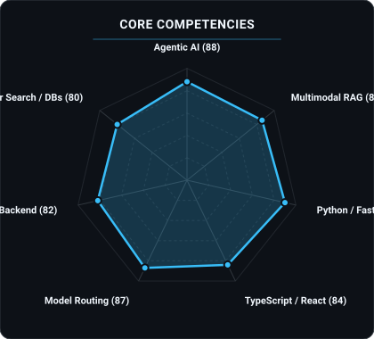
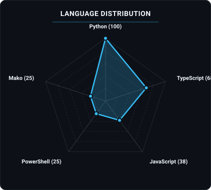
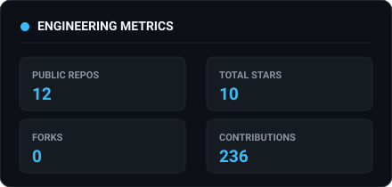
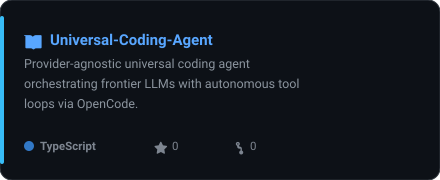
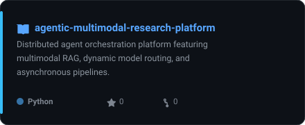
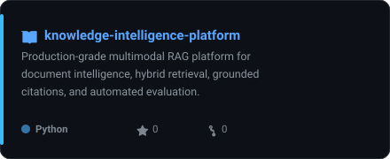
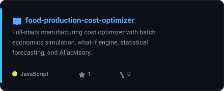

<picture>
  <source media="(prefers-color-scheme: dark)" srcset="assets/hero-portrait.png">
  <source media="(prefers-color-scheme: light)" srcset="assets/hero-portrait.png">
  
</picture>

 

# OM TALAVIYA
### `AI` &bull; `SOFTWARE` &bull; `DATA`

  
  
  
  
  

<picture>
  <source media="(prefers-color-scheme: dark)" srcset="assets/status-dark.svg">
  <source media="(prefers-color-scheme: light)" srcset="assets/status-light.svg">
  
</picture>

---

### `~/` whoami

Hi, I'm **Om Talaviya** — an AI & Systems Engineer specialized in building production-grade agentic platforms, multimodal RAG architectures, and intelligent full-stack systems. Focused on model routing, autonomous developer workflows, and end-to-end reliability.

- 🔭 **Currently Building**: [Universal Coding Agent](https://github.com/Om-Talaviya/Universal-Coding-Agent) & [Agentic Multimodal Research Platform](https://github.com/Om-Talaviya/agentic-multimodal-research-platform)
- ⚡ **Focus Areas**: Agentic AI Orchestration, Multimodal RAG Systems, Model Gateways & Distributed Backends
- 🛠️ **Core Technologies**: Python, TypeScript, React/Next.js, FastAPI, Node.js, Vector Databases, Docker
- 💡 **Engineering Approach**: Developing deterministic, autonomous architectures that transform frontier AI research into high-impact software systems

---

### `~/` architecture-pipeline

<picture>
  <source media="(prefers-color-scheme: dark)" srcset="assets/architecture-dark.svg">
  <source media="(prefers-color-scheme: light)" srcset="assets/architecture-light.svg">
  
</picture>

---

### `~/` toolbox

---

### `~/` engineering-radars

<table>
  <tr>
    <td width="50%" align="center">
      <picture>
        <source media="(prefers-color-scheme: dark)" srcset="assets/radar-dark.svg">
        <source media="(prefers-color-scheme: light)" srcset="assets/radar-light.svg">
        
      </picture>
    </td>
    <td width="50%" align="center">
      <picture>
        <source media="(prefers-color-scheme: dark)" srcset="assets/radar-langs-dark.svg">
        <source media="(prefers-color-scheme: light)" srcset="assets/radar-langs-light.svg">
        
      </picture>
    </td>
  </tr>
</table>

---

### `~/` activity-stream

<table>
  <tr>
    <td width="50%" align="center">
      <picture>
        <source media="(prefers-color-scheme: dark)" srcset="assets/card-stats-dark.svg">
        <source media="(prefers-color-scheme: light)" srcset="assets/card-stats-light.svg">
        
      </picture>
    </td>
    <td width="50%" align="center">
      <picture>
        <source media="(prefers-color-scheme: dark)" srcset="assets/metrics.isocalendar.svg">
        <source media="(prefers-color-scheme: light)" srcset="assets/metrics.isocalendar.svg">
        
      </picture>
    </td>
  </tr>
</table>

 

  <picture>
    <source media="(prefers-color-scheme: dark)" srcset="https://raw.githubusercontent.com/Om-Talaviya/Om-Talaviya/output/snake-dark.svg">
    <source media="(prefers-color-scheme: light)" srcset="https://raw.githubusercontent.com/Om-Talaviya/Om-Talaviya/output/snake-light.svg">
    
  </picture>

---

### `~/` featured-systems

<table>
  <tr>
    <td width="50%" align="center">
      <a href="https://github.com/Om-Talaviya/Universal-Coding-Agent">
        <picture>
          <source media="(prefers-color-scheme: dark)" srcset="assets/card-universal-coding-agent-dark.svg">
          <source media="(prefers-color-scheme: light)" srcset="assets/card-universal-coding-agent-light.svg">
          
        </picture>
      </a>
    </td>
    <td width="50%" align="center">
      <a href="https://github.com/Om-Talaviya/agentic-multimodal-research-platform">
        <picture>
          <source media="(prefers-color-scheme: dark)" srcset="assets/card-agentic-multimodal-research-platform-dark.svg">
          <source media="(prefers-color-scheme: light)" srcset="assets/card-agentic-multimodal-research-platform-light.svg">
          
        </picture>
      </a>
    </td>
  </tr>
  <tr>
    <td width="50%" align="center">
      <a href="https://github.com/Om-Talaviya/knowledge-intelligence-platform">
        <picture>
          <source media="(prefers-color-scheme: dark)" srcset="assets/card-knowledge-intelligence-platform-dark.svg">
          <source media="(prefers-color-scheme: light)" srcset="assets/card-knowledge-intelligence-platform-light.svg">
          
        </picture>
      </a>
    </td>
    <td width="50%" align="center">
      <a href="https://github.com/Om-Talaviya/food-production-cost-optimizer">
        <picture>
          <source media="(prefers-color-scheme: dark)" srcset="assets/card-food-production-cost-optimizer-dark.svg">
          <source media="(prefers-color-scheme: light)" srcset="assets/card-food-production-cost-optimizer-light.svg">
          
        </picture>
      </a>
    </td>
  </tr>
</table>

---

  Engineered by <strong>Om Talaviya</strong> &bull; Automated via GitHub Actions &bull; Crafted with Python & SVG

